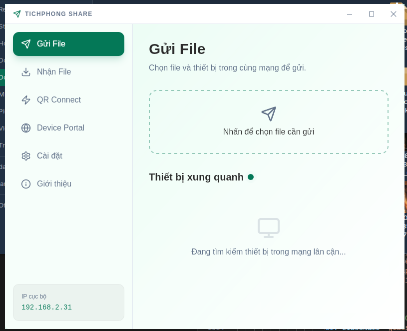
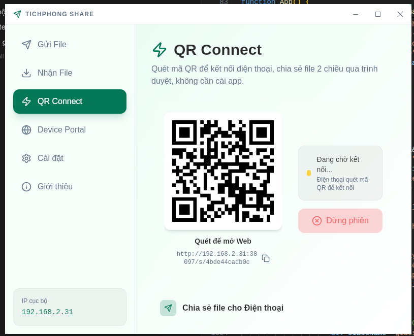
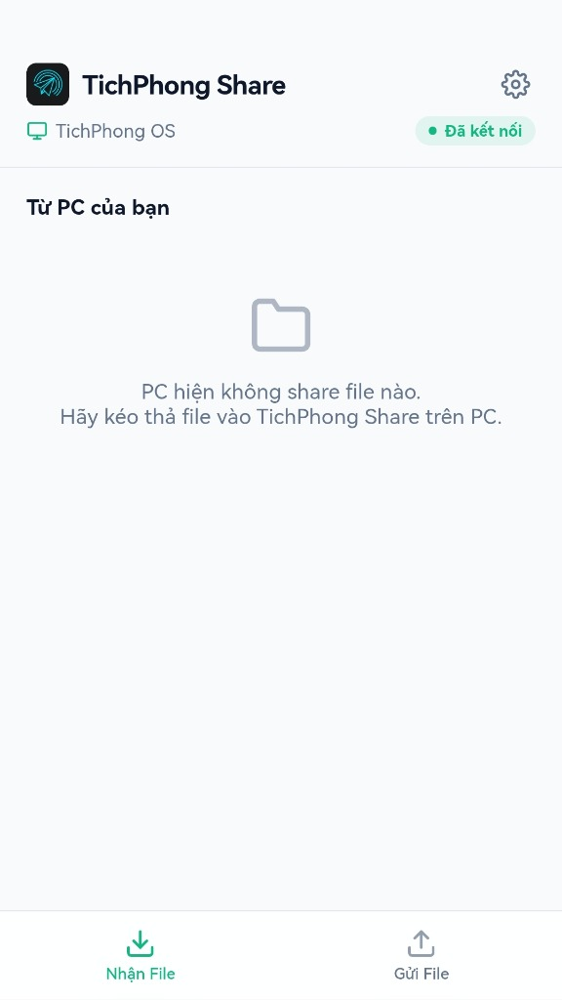

# TichPhong Share 🚀

*[🇻🇳 Xem phiên bản Tiếng Việt bên dưới (Scroll down for Vietnamese)]*

TichPhong Share is an ultra-fast, open-source file sharing application built with **Tauri v2** and **React**. The app is cross-platform and deeply integrated into the **TichPhong OS** ecosystem, allowing seamless file sharing via **LocalSend**, **Quick Share (Nearby Connections)**, and **QR Connect (TichPhong Direct)**.

<p align="center">
  
  
  <br/>
  
</p>

## ✨ Key Features

- ⚡ **High Speed**: Transfer files over LAN with no file size limits. Wi-Fi 5/6 can reach 30–100+ MB/s.
- 📱 **High Compatibility**: Supports **LocalSend** and **Google Quick Share** protocols, making it easy to transfer files directly to Android, Windows, and other devices.
- 📸 **QR Connect (TichPhong Direct)**: Embedded WebApp Server - No app installation required for receivers. Scan QR on PC to share files bidirectionally via browser.
  - **Connection Modes**: **LAN Mode** (existing network) and **Direct Hotspot** (PC creates a secure Wi-Fi network automatically via `nmcli` or `netsh`).
  - **Data Hub Model**: Supports multiple devices (phones, laptops) connecting to a single PC simultaneously.
  - **Smart User-Agent Parsing**: Accurately detects mobile models (e.g., `Android (Pixel 7)`, `Apple iPhone`) and automatically adds unique 4-character identifiers to PC connections (e.g., `Windows PC (#A4B1)`) for group sharing.
  - **Transmission Optimization**: Supports connection resume via `HTTP Range Requests` and On-the-fly ZIP streaming for folders, saving RAM and Disk space.
  - **Inactivity Timeout**: Sessions remain alive indefinitely and only auto-terminate after 30 minutes of complete inactivity from all connected devices.
  - **Smart Port Fallback**: Always prioritizes user-configured ports, gracefully falling back to a random port if occupied to prevent server hangs.
- 🔒 **Secure 2-Step Upload**: Phone requests upload → PC approves/rejects → only then file data is transmitted. No file is saved without explicit approval.
- 🎨 **Modern UI**: Sleek interface with Dark/Light Mode and 6 accent color themes (Jade, Mystic, Cinnabar, Purple, Tết, Zen).
- 📁 **Smart File Handling**: Automatic file deduplication (adds `(1)`, `(2)` suffix instead of overwriting), folder ZIP streaming, HTTP Range request support for large downloads.
- 🌐 **Bilingual WebApp**: Mobile web interface supports Vietnamese & English with automatic language detection.
- 🔓 **Open Source**: Transparent and safe. We do not track or collect user data.

## 🛠 Tech Stack

- **Frontend**: React 19, TypeScript, Tailwind CSS v4, Framer Motion, Lucide Icons.
- **Backend/Core**: Rust, Tauri v2, Axum (HTTP/WebSocket server).
- **Protocols**: LocalSend Protocol, Quick Share (Nearby Connections), TichPhong Direct (WebSocket + HTTP multipart).

## 📥 Download & Installation

TichPhong Share provides pre-built installers for multiple operating systems.

1. Go to the project's **[Releases](https://github.com/doccosau/TichPhong-Share/releases)** page on GitHub.
2. Download the installer for your device:
   - **Linux**: `.deb` (Ubuntu, Debian, TichPhong OS, Zorin OS, Mint) or `.rpm` (Fedora, openSUSE).
   - **Windows**: `.exe` installer (Windows 10/11).
3. Run the downloaded file and install.

## 💻 Build from Source (For Developers)

### Prerequisites
- Node.js (v18+)
- Rust & Cargo
- Tauri's system dependencies (See [Tauri Prerequisites](https://tauri.app/start/prerequisites/))

### Steps
1. **Clone the repository**:
   ```bash
   git clone https://github.com/doccosau/TichPhong-Share.git
   cd TichPhong-Share
   ```
2. **Install npm packages**:
   ```bash
   npm install
   ```
3. **Run in development mode**:
   ```bash
   npm run tauri dev
   ```
4. **Compile a release build**:
   ```bash
   npm run tauri build
   ```
   *The build output is in `src-tauri/target/release/bundle/`.*

## 🏗 Architecture

```
┌──────────────────────────────────────────────────────┐
│                    Tauri v2 App                       │
│  ┌──────────────┐  ┌─────────────────────────────┐   │
│  │  React UI    │  │     Rust Backend             │   │
│  │  (App.tsx)   │◄─┤  ├── LocalSend Protocol      │   │
│  │              │  │  ├── Quick Share (rqs_lib)    │   │
│  └──────────────┘  │  ├── QR Connect (qrc.rs)     │   │
│                    │  │   ├── WebSocket Server     │   │
│                    │  │   ├── HTTP File Server      │   │
│                    │  │   └── Embedded WebApp       │   │
│                    │  └── Settings & History        │   │
│                    └─────────────────────────────────┘   │
└──────────────────────────────────────────────────────┘
         │                          │
    ┌────▼────┐              ┌──────▼──────┐
    │ Desktop │              │ Mobile Phone│
    │ Devices │              │ (Browser)   │
    │ (LAN)   │              │ QR Connect  │
    └─────────┘              └─────────────┘
```

## 📄 License & Open Source

**TichPhong Share** is released under the **MIT License**.

This project uses the following open-source components:
- **Tauri Framework** (MIT / Apache-2.0)
- **React** (MIT)
- **Tailwind CSS** (MIT)
- **Framer Motion** (MIT)
- **Lucide Icons** (ISC)
- **LocalSend Protocol** (MIT) — LAN device discovery and file transfer.
- **Quick Share / rqs_lib** (GPLv3) — Android/Windows Nearby Connections compatibility.

---

# 🇻🇳 Phiên bản Tiếng Việt

TichPhong Share là ứng dụng chia sẻ tệp mã nguồn mở siêu tốc, xây dựng với **Tauri v2** và **React**. Hỗ trợ đa nền tảng, tích hợp sâu với hệ sinh thái **TichPhong OS**, cho phép chia sẻ file qua **LocalSend**, **Quick Share (Nearby Connections)** và **QR Connect (TichPhong Direct)**.

<p align="center">
  
  
  <br/>
  
</p>

## ✨ Tính năng nổi bật

- ⚡ **Tốc độ cao**: Truyền tệp qua mạng LAN, không giới hạn dung lượng. Wi-Fi 5/6 đạt 30–100+ MB/s.
- 📱 **Tương thích cao**: Hỗ trợ giao thức **LocalSend** và **Google Quick Share**, chuyển tệp trực tiếp sang Android, Windows dễ dàng.
- 📸 **QR Connect (TichPhong Direct)**: WebApp Server Nhúng - Thiết bị nhận file **KHÔNG CẦN CÀI ĐẶT APP**.
  - **Chế độ kết nối**: **LAN Mode** (dùng mạng hiện có) và **Direct Hotspot** (PC tự phát Wi-Fi bằng `nmcli` hoặc `netsh`, không cần Router).
  - **Mô hình Data Hub**: Cho phép kết nối nhóm (nhiều điện thoại, laptop cùng lúc truy cập vào 1 phiên).
  - **Nhận diện thiết bị thông minh**: Bóc tách mã máy chi tiết (VD: `Android (Pixel 7)`, `Apple iPhone`) và tự động gắn mã định danh 4 ký tự cho PC (VD: `Windows PC (#A4B1)`) để chống trùng lặp.
  - **Tối ưu hóa Truyền tải**: Hỗ trợ tải lại (Resume) bằng `HTTP Range Requests`. Nén thư mục và tải xuống dạng luồng (On-the-fly ZIP streaming) giúp tiết kiệm dung lượng đĩa và RAM.
  - **Quản lý Phiên (Inactivity Timeout)**: Phiên kết nối vô thời hạn, chỉ tự động hủy khi **không có bất kỳ thiết bị nào tương tác** trong vòng 30 phút.
  - **Cấu hình mạng an toàn**: Luôn ưu tiên dùng Cổng tùy chỉnh (Custom Port). Nếu cổng bị chiếm dụng, tự động fallback về cổng ngẫu nhiên thay vì làm treo hệ thống.
- 🔒 **Upload an toàn 2 bước**: Điện thoại yêu cầu gửi → PC duyệt/từ chối → file mới được truyền. Không file nào được lưu khi chưa được phê duyệt.
- 🎨 **Giao diện hiện đại**: Dark/Light Mode với 6 bảng màu accent (Jade, Mystic, Cinnabar, Purple, Tết, Zen).
- 📁 **Quản lý file thông minh**: Tự động thêm số thứ tự `(1)`, `(2)` khi trùng tên (không ghi đè), nén thư mục ZIP streaming, hỗ trợ HTTP Range request.
- 🌐 **WebApp song ngữ**: Giao diện web trên điện thoại hỗ trợ Tiếng Việt & Tiếng Anh.
- 🔓 **Mã nguồn mở**: Minh bạch, an toàn. Không theo dõi, không thu thập dữ liệu.

## 🛠 Công nghệ sử dụng

- **Frontend**: React 19, TypeScript, Tailwind CSS v4, Framer Motion, Lucide Icons.
- **Backend/Core**: Rust, Tauri v2, Axum (HTTP/WebSocket server).
- **Giao thức**: LocalSend Protocol, Quick Share (Nearby Connections), TichPhong Direct (WebSocket + HTTP multipart).

## 📥 Tải xuống và Cài đặt

1. Truy cập trang **[Releases](https://github.com/doccosau/TichPhong-Share/releases)** trên GitHub.
2. Tải file cài đặt phù hợp:
   - **Linux**: `.deb` (Ubuntu, Debian, TichPhong OS, Zorin OS, Mint) hoặc `.rpm` (Fedora, openSUSE).
   - **Windows**: `.exe` (Windows 10/11).
3. Chạy file và cài đặt bình thường.

## 💻 Hướng dẫn Build (Dành cho Lập trình viên)

### Yêu cầu
- Node.js (v18+)
- Rust & Cargo
- Các thư viện phụ thuộc Tauri ([Xem chi tiết](https://tauri.app/start/prerequisites/))

### Các bước
1. **Clone repository**:
   ```bash
   git clone https://github.com/doccosau/TichPhong-Share.git
   cd TichPhong-Share
   ```
2. **Cài đặt npm packages**:
   ```bash
   npm install
   ```
3. **Chạy Dev mode**:
   ```bash
   npm run tauri dev
   ```
4. **Build Release**:
   ```bash
   npm run tauri build
   ```
   *Bản build nằm trong `src-tauri/target/release/bundle/`.*

## 📄 Giấy phép & Mã nguồn mở

**TichPhong Share** phát hành dưới Giấy phép **MIT License**.

Các mã nguồn mở được sử dụng:
- **Tauri Framework** (MIT / Apache-2.0)
- **React** (MIT)
- **Tailwind CSS** (MIT)
- **Framer Motion** (MIT)
- **Lucide Icons** (ISC)
- **LocalSend Protocol** (MIT) — Dò tìm và truyền file qua mạng cục bộ.
- **Quick Share / rqs_lib** (GPLv3) — Tương thích Nearby Connections trên Android và Windows.

---
*Built with ❤️ by the TichPhong OS Team.*
